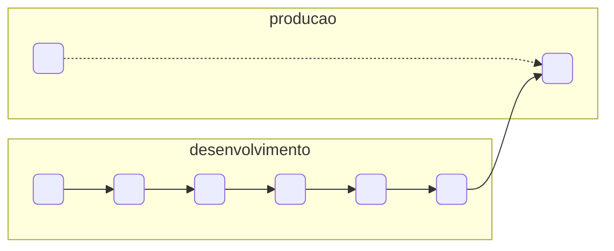

# X11 Docker Ubuntu Mate Desktop environment

A minimal Mate desktop environment based on Ubuntu 18.04 for creating desktop environments you can run with X11Docker

```mermaid
graph LR 

  subgraph desenvolvimento
  commitdev0(" ") --> commitdev1(" ")
  commitdev1 --> commitdev2(" ")
  commitdev2 --> commitdev3(" ")
  commitdev3 --> commitdev4(" ") 
  commitdev4 --> commitdev5(" ") 
  end

  subgraph producao
  commitproducao1(" ") -......-> commitproducao2(" ")
  end

commitdev5 --> commitproducao2
```
